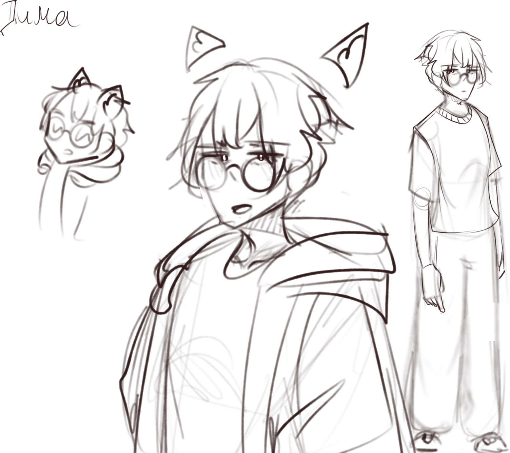

<h1><b>Имя</b>: Дмитрий</h1>

<h3><b>Пол</b>:  Мужской</h3>

<h3><b>Внешний вид</b>: Обычный парень с тёмными волосами, круглыми очками, ходит в основном в закрытой чёрной одежде.</h3>

<h3><b>Характеристика:</b>
Сангвиник с уклоном к флегматику.

Спокойный, но в то же время весёлый.

Из-за некоторых событий c детства немного замкнутый и с ходу ему не удобно через, если только не через Дискорд. 

Когда он находит свою зону комфорта в обществе (группа людей, схожие с ним интересами) ведёт себя открыто, весело, часто шутит и в целом о нём складывается впечатление, что он уверенный в себе, жизнерадостный, умеет справляться с трудностями

Но в действительности у него низкая, самокритичная, самооценка и он не имеет цели в жизни, он не знает чего хочет и даже не может найти себе любимое занятие. Гулять не любит, предпочитает смотреть аниме, слушать музыку. Очень много времени потратил в разных играх и чувствует себя комфортно в них.</h3> 

</img>
