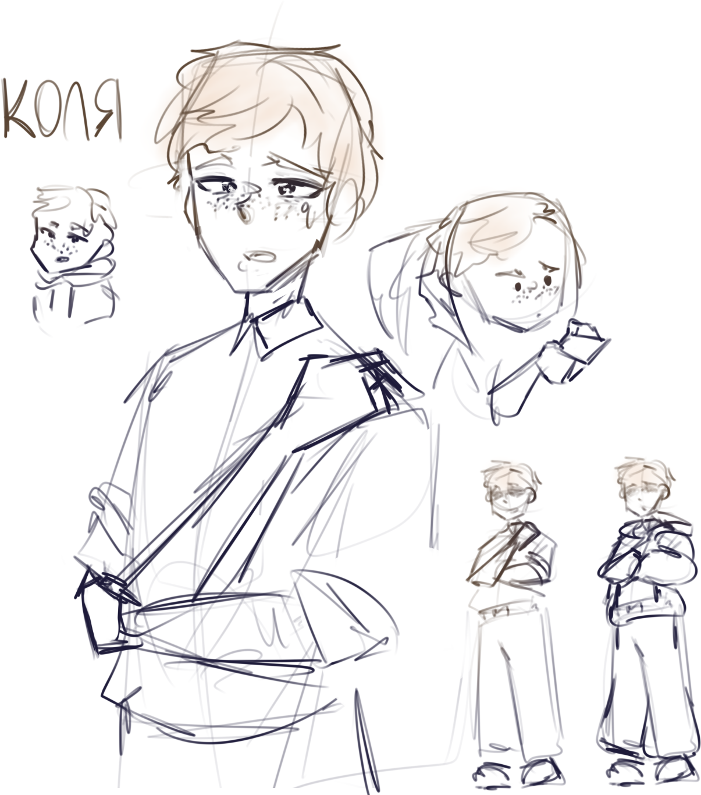

<h1><b>Имя</b>: Коля</h1>
<h3><b>Пол</b>: Мужской</h3>
<h3><b>Внешний вид</b>: Стройный парень с рыжими волосами. Ходит в обычной одежде в колледже и в матовых, пастельных цветах дома, нося обычно шаравары и худи. </h3>
<h3><b>Характеристика:</b>

Очень зажатый в себе человек.

Единственный способ для него контактировать с другими – интернет. 

Дома - булка, в шараге - булка, в интренете - альтер-эго

Когда он находит близких по духу людей, то спустя большое количество времени начинает открываться им и может: активно общаться не только в интернете, но и в IRL; шутить; смеятся и т.д.
(активный с ходу только в интернете и очень дерзкий в нём, ну чисто интернетный типочек, для него дс – второй дом, если не первый).</h3>

</img>